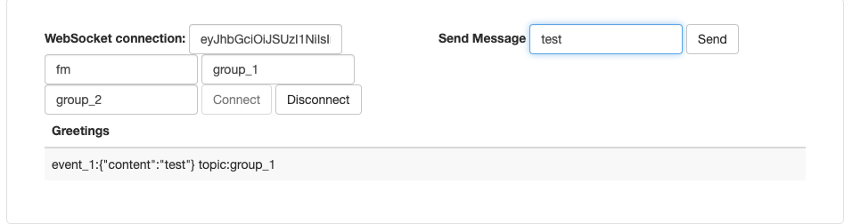

# socket.io.java.server.biz

![][license-url]

基于netty-socketio实现的推送中心，屏蔽使用细节，使用socketio协议实现项目隔离，多播，
单播。
- 支持多项目隔离
- 支持JWT鉴权
- 支持灵活订阅多播，单播
- 支持高可用
- 支持横向扩容

配套[socket.io.client.biz](https://github.com/DFocusFE/socket.io.client.biz)客户端和[socket.io.java.client.biz](https://github.com/DFocusFE/socket.io.java.client.biz)客户端使用

相关文档参见: [wiki](https://github.com/DFocusFE/socket.io.java.server.biz/wiki)

## 快速启动

1. `git clone https://github.com/DFocusFE/socket.io.java.server.biz.git`
2. `sh socket.io.java.server.biz/tools/build-restart`
3. 打开测试页面`http://127.0.0.1:8080/msg-center`
4. 连接服务端,发送消息

## LICENSE

[MIT License](https://raw.githubusercontent.com/DFocusFE/socket.io.java.client.biz/master/LICENSE)

[license-url]: https://img.shields.io/github/license/dfocusfe/socket.io.java.client.biz
